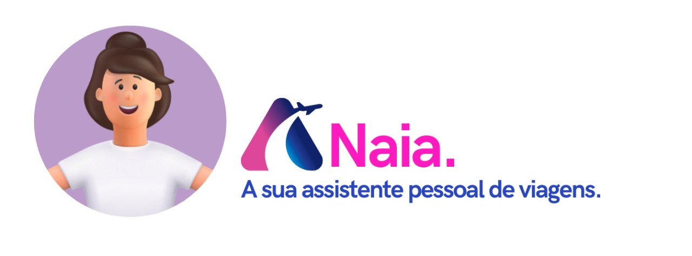

<p align="center">
    
</p>

Oi, sou a [Naia](https://main.d8tjyohy7nc8r.amplifyapp.com/) project desenvolvido utilizando [`next.js`](https://github.com/vercel/next.js) e api's da [`amadeus`](https://developers.amadeus.com/).


## Sobre
Meu objetivo é ser um assitente pessoal de viagens, desevolvido para o [Hack the Journey 2022](https://hackthejourney.com.br/)

## Para começar

Para rodar o ambiente em modo desenvolvimento:

1. Você deve configurar seu `.env` copiando do `.env.example` e colocando suas credencias amadeus.
2. Rodando os seguintes comandos:

```bash
npm run dev
# ou
yarn dev
```
E abrir [http://localhost:3000](http://localhost:3000) com seu navegador.

Caso você prefira, pode testar utilizando o ambiente rodando com amplify:

- [Ambiente Desenvolvimento](https://main.d8tjyohy7nc8r.amplifyapp.com/)

## Stack Tecnologias

- Amadeus Api For Developers `(Inspire, Search, Insights, Booking)`
- Google Maps API `(Futuro)`
- Google Agenda `(Futuro)`
- AWS Amplify
  

